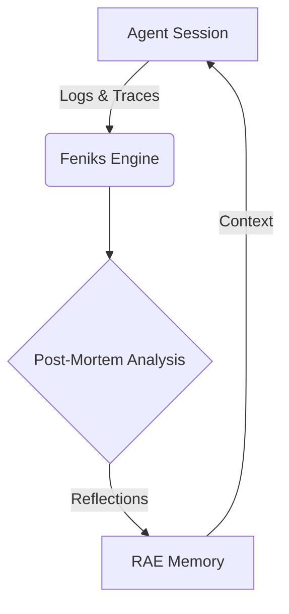

# Pętle Refleksji (Reflection Loops)

Unikalną wartością systemu Feniks jest jego zdolność do **Meta-Refleksji**. Oznacza to, że system nie tylko wykonuje zadania, ale również analizuje *sposób*, w jaki te zadania zostały wykonane, oraz wyciąga wnioski na przyszłość.

Mechanizm ten opiera się na trzech głównych pętlach sprzężenia zwrotnego.

---

## 1. Pętla Post-Mortem (Immediate Feedback)

**Cel**: Szybka korekta błędów i ocena jakości pojedynczej sesji.

Ta pętla uruchamia się natychmiast po zakończeniu sesji agenta (sukces lub porażka).

### Analizowane Elementy:
*   **Reasoning Trace**: Czy proces myślowy był spójny? Czy wystąpiły pętle (powtarzanie tej samej akcji)? Czy myśli (thoughts) były puste lub trywialne?
*   **Koszt**: Czy sesja zmieściła się w założonym budżecie?
*   **Wynik**: Czy cel został osiągnięty?

### Przykładowa Refleksja:
> *"Agent wpadł w pętlę decyzyjną przy próbie edycji pliku `auth.py`. Wykonał 3 razy tę samą nieudaną próbę zapisu. Rekomendacja: Zwiększyć "temperaturę" modelu w przypadku powtarzających się błędów."*

---

## 2. Pętla Longitudinal (Trend Analysis)

**Cel**: Wykrywanie systemowych problemów i trendów w czasie.

Ta pętla analizuje zbiór sesji z dłuższego okresu (np. tydzień, miesiąc). Pozwala to na wykrycie problemów, które są niewidoczne w skali pojedynczego zadania.

### Analizowane Elementy:
*   **Wskaźnik Sukcesu (Success Rate)**: Czy spada w czasie?
*   **Trend Kosztów**: Czy średni koszt rozwiązania zadania rośnie?
*   **Wzorce Błędów**: Czy konkretny typ błędu (np. `FileNotFound`) pojawia się coraz częściej?

### Przykładowa Refleksja:
> *"W ciągu ostatnich 2 tygodni średni koszt sesji wzrósł o 25%, mimo braku zmian w złożoności zadań. Sugeruje to problem z "prompt bloating" (nadmiernym rozrostem kontekstu)."*

---

## 3. Pętla Self-Model (System Consciousness)

**Cel**: Ochrona systemu przed degradacją i utrzymanie higieny operacyjnej.

To najwyższy poziom refleksji. Feniks analizuje własne działanie jako system analityczny.

### Analizowane Elementy:
*   **Zmęczenie Alertami (Alert Fatigue)**: Czy system generuje zbyt wiele krytycznych alertów, które są ignorowane przez ludzi?
*   **Skuteczność Rekomendacji**: Czy sugerowane poprawki faktycznie prowadzą do poprawy kodu?

### Przykładowa Refleksja:
> *"W ostatnich 24 godzinach wygenerowano 50 alertów o randze CRITICAL. Ryzyko ignorowania powiadomień przez zespół jest wysokie. System automatycznie podnosi próg dla alertów krytycznych."*

---

## Integracja z RAE

Wszystkie wygenerowane refleksje są nie tylko zapisywane w raportach, ale również przesyłane do pamięci długoterminowej silnika **RAE**. Dzięki temu, przy kolejnym uruchomieniu, agent ma dostęp do wniosków z przeszłości i nie popełnia tych samych błędów.

